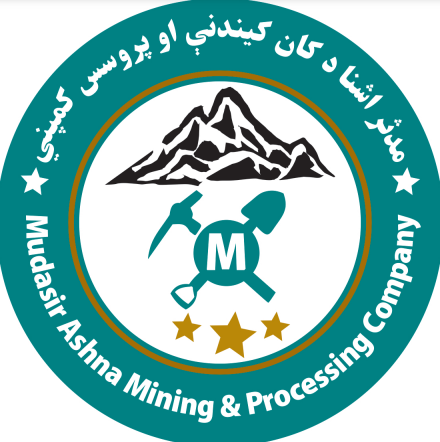
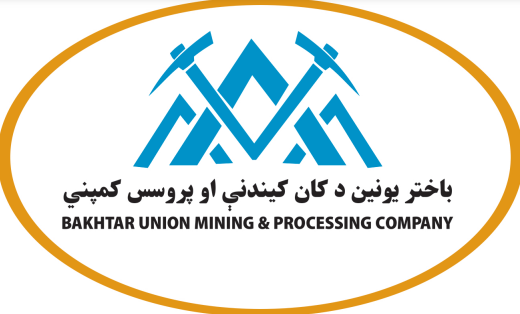

<!DOCTYPE html>
<html lang="en">
<head>
    <meta charset="UTF-8">
    <meta name="viewport" content="width=device-width, initial-scale=1.0">
    <title>Qara-Zaghan Gold Mine | Mudasir Ashna & Bakhtar Union</title>
    
</head>
<body>

Joint Mining & Processing Project | Mudasir Ashna × Bakhtar Union

<header>
    

        

            <!-- Mudasir Ashna Logo -->
            
            <h3>Mudasir Ashna Mining & Processing Company</h3>
        

        
✦

        

            <!-- Bakhtar Union Logo -->
            
            <h3>Bakhtar Union Mining & Processing Company</h3>
        

    

</header>

    <h1>Qara-Zaghan Gold Mine Project</h1>
    
Joint Exploration & Sampling Records

<main>
    

        <h2>Project Overview</h2>
        
<strong>Location:</strong> Doshi District, Baghlan Province, Afghanistan

        
<strong>Operators:</strong> Mudasir Ashna Mining & Processing Company & Bakhtar Union Mining & Processing Company

        
<strong>Activity:</strong> Gold Exploration, Mining & Mineral Processing

    

    

        

            <h2>Collected Sample Details</h2>
            Sample ID: ABQ-01
        

        
<strong>Collection Date:</strong> 17 July 2026

        
<strong>Sample Type:</strong> Quartzite with Gold Mineralization

        
<strong>Coordinates:</strong> 35°33′43.77″ N 68°22′05.42″ E

        
<strong>Collected By:</strong> Mudasir Ashna & Bakhtar Union Field Team

        <!-- Photo Upload Area -->
        

            
📷 Sample Photo Placeholder

            
Upload or paste your sample image here

            <!-- Uncomment and replace the link below to display your image:
            
            -->
        

    

    <button class="btn" onclick="toggleForm()">➕ Add New Sample Record</button>
    

        <h3>Register New Sample</h3>
        <input type="text" placeholder="Sample ID (e.g. ABQ-02)" required>
        <input type="date" required>
        <input type="text" placeholder="Sample Type & Mineral Content" required>
        <input type="text" placeholder="GPS Coordinates" required>
        <input type="text" placeholder="Location / Zone" required>
        <textarea placeholder="Remarks, Lab Results or Additional Notes" rows="3"></textarea>
        <input type="file" accept="image/*">
        <button class="btn btn-save">Save Sample Record</button>
    

</main>

<footer>
    
&copy; 2026 Qara-Zaghan Gold Mine Project. All Rights Reserved.

    
Mudasir Ashna Mining & Processing Company | Bakhtar Union Mining & Processing Company

</footer>

</body>
</html>
